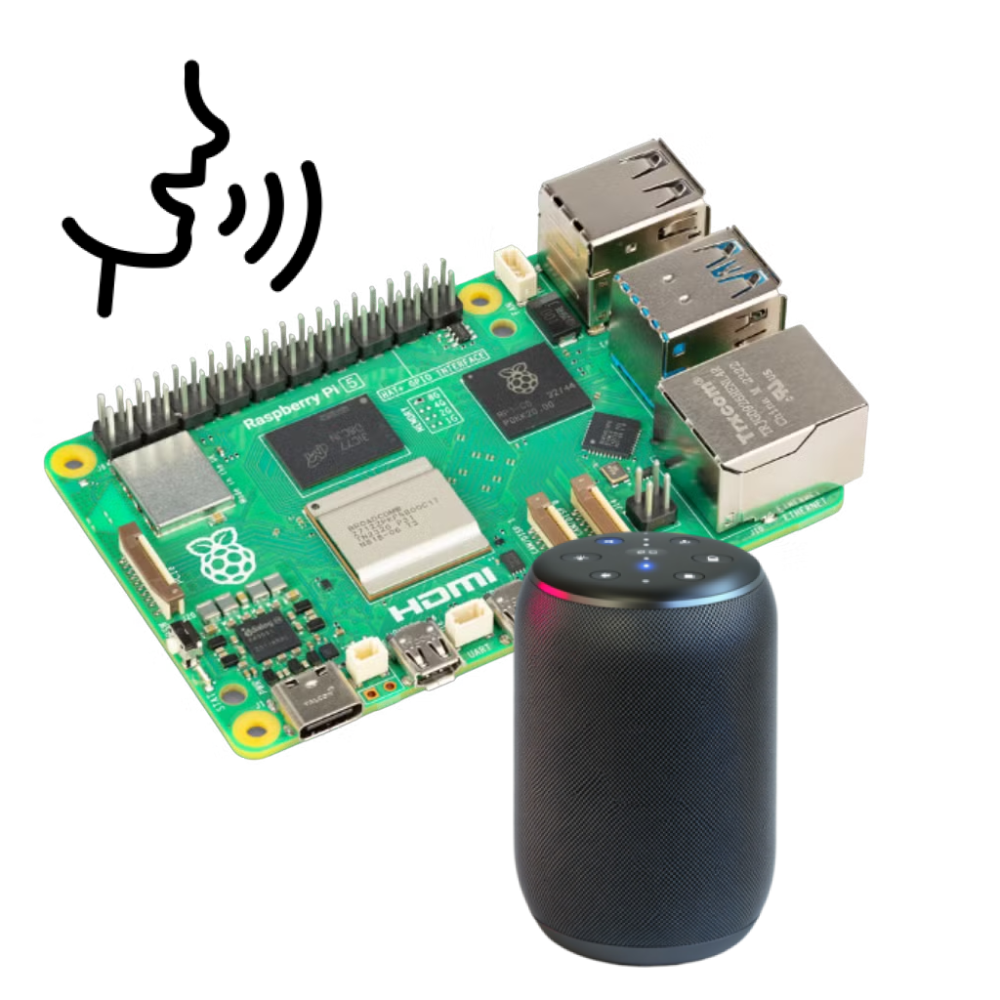

# Raspi agent (DIY voice assistance)
**Raspi-Agent** is a modular streaming voice assistant for Raspberry Pi with built-in wake-word detection, streaming audio, and LLM back-end support (on-device or off-device)

### *Currently, in development ...*

## Planned Features
- [x] Wake word detection
- [x] Streaming audio playback
- [x] Natural conversation via OpenAI APIs
- [ ] RAG integration
- [ ] Agent memory
- [ ] Web dashboard

---

##  Features

- **Wake Word Detection** — powered by [Porcupine](https://picovoice.ai/platform/porcupine/)
- **Streaming Audio Playback** — real-time PCM or MP3 output via PortAudio
- **Natural Conversation** — integrates with OpenAI (STT, LLM, TTS)
- **Dual Architecture** — choose between:
    - **Onboard mode** — runs all AI calls directly from the Pi
    - **Offboard mode** — sends recordings to a backend for processing

## Architecture Overview
> Wake Word → Recorder → Voice Assistant → Player → User

Two orchestrator implementations:

| Mode | Description | Example                         |
|------|--------------|---------------------------------|
| **Onboard** | Runs everything locally via OpenAI APIs (STT, LLM, TTS) | `cmd/raspi-agent-onboard-local`       |
| **Offboard** | Streams recorded audio to a backend that processes it | `cmd/raspi-agent-onboard` |

---
